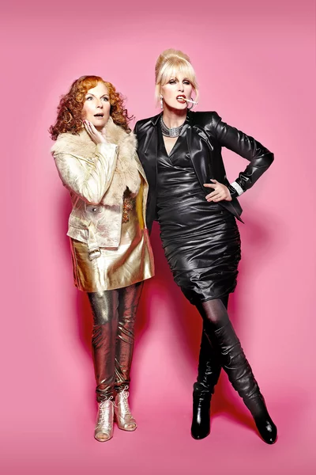

Basics in R package Building:human centered problems and solutions
========================================
author: Elisabeth Dahlqwist & Nissa Ferm
date: R-Ladies Stockholm on October 23, 2019
font-import: http://fonts.googleapis.com/css?family=Mansalva
font-family: 'Mansalva'

Elisabeth Dahlqwist
========================================================
Cool things about me...

- Biostatistician
- neato thing two

Nissa Ferm 
========================================================
incremental: true

***
- Recent transplant to Stockholm.
- Government fishereies researcher turned data scientist .
- Built R-packages FastrCAT, rrza, and fishgutr.
- Made my first PR during Tidyverse Dev Day on the dplyr package 🎉.
- I also love crafting and sea critters 😍!

R Packages on CRAN
========================================================
incremental: true 
left:60%

***
As of this year
- 15007 on CRAN 
- ~ 2116 on GitHub (includes dev versions of CRAN Packages)
- 1741 on BioConductor
- ~ 18864 + known packages!  🤯

So many packages, why make more?
========================================================
incremental: true 
left:40%

***
- A 📦 can be just for you  
- A 📦 can be specific to your use case  
- 📦's are easily sharable 
- 📦's are great for method development, easy documentation  
- 📦's encapsulate a project, all files in one place!

Elisabeth why I built a package
========================================================

- share new stats methods

Why I built a package
========================================================
incremental: true 
left:16%

***
- Data was trapped in a particular type of oceanographic file  
- Thousands of these files were created each field season  
- Past methods ment data wasn't available for more than a year   
- I wanted to use the data while still out on the research cruise 🚢 📈!

So, I built FastrCAT
========================================================
incremental: true 
left:50%

***
FastrCAT...

- streamlined the data aquisition
- did not have to wait a year or more
- has functions to produce maps, plots and reports
- the package was used succesfully this past field season!

First Steps: Picking a Style
========================================================

***
- Google Style Guide
https://google.github.io/styleguide/Rguide.html
  
- Tidyverse Style Guide
https://style.tidyverse.org/

- Biocondoctor Style Guide
https://bioconductor.org/developers/how-to/coding-style/

- Your job might also have its own guide too. 

What is human readable code?
========================================================
incremental: true 
left:35% 

***
- Wikipedia defines human readable as, "A human-readable medium or human-readable format is a representation of data or information that can be naturally read by humans."  

Basics...
- meaningful file names, w/o spaces
- use snake_case or CamelCase, != both or dot.case
- objects or variables are nouns
- functions are verbs

Documentation
========================================================

- how creating a package forces you to document everything
- documentation is realtive to your audience
- unhelpful documentation
- helpful documentation

Documentation - E
========================================================
- function documentation example
- why is this helpful
- give a reproducable example
- who are your users and how you write the documentation
- example glm object

Documentation
========================================================
- package level example
- why is this helpful
- should you add a data set

Documentation
========================================================
- vingette example
- you want your users to understand, give examples

Elisabeth Example One
=======================================================

- targeting your users
- Journal Article about package and examples with theory
- what to do, documentation in line level you expect from users

Nissa Example One
=======================================================

***

- how error writing is documentation too
- writting errors to help your users

Careful with your dependencies
=======================================================

***
- some overview of dependencies

Elisabeth Example Two
=======================================================

- import vs depends
- which r version with uploading to CRAN r devel

Nissa Example Two
=======================================================
- maps without the internet
- why I didn't use ggmap
- how did I realize this was an issue
- how did I solve this issue
- where it went in the package folder hierarchy
- what were all the packages I used
- show how it was written in the package/ folders

How your users interct with your package
=======================================================

***
- transition slide
- interacting

Elisabeth Example Three
=======================================================

- what is the output of your package
- in r oop, classes
- print glm and formats example, plot function
- model object look similar across packages

Nissa Example Three
=======================================================

- from the console
- why I did it this way for my users
- how you share

Last Slide 
========================================================
- live package build in Rstudio

