<style>
body {
      background-image: 
      url(https://raw.githubusercontent.com/rladies/starter-kit/master/stickers/hex-logo-with-text.png);
      background-position: left bottom;
      background-attachment: fixed;
      background-repeat: no-repeat;
      background-size: 15% 30%;
}

.section .reveal .state-background {
    background: #2d6b74; 
    background-image: 
    url(https://raw.githubusercontent.com/rladies/starter-kit/master/stickers/hex-logo-with-text.png);
    background-position: right bottom;
    background-attachment: fixed;
    background-repeat: no-repeat;
    background-size: 30% 60%;
}

.reveal ul,
.reveal ol,
.reveal p {
    font-size:24pt;
    font-family: 'Oswald', sans-serif;
    color: #000000;
}
</style>


Basics in R package Building:human centered problems and solutions
========================================
author: Elisabeth Dahlqwist & Nissa Ferm
date: R-Ladies Stockholm on October 23, 2019
font-import: http://fonts.googleapis.com/css?family=Mansalva
font-family: 'Mansalva'


Elisabeth Dahlqwist
========================================================
incremental: true 

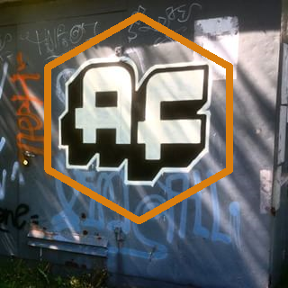

***
- PhD in Biostatistics from Karolinska Institutet (KI). Currently working as a methods statistician at Statistics Sweden (SCB).
<br>
<br>
- Interested in causal inference and data quality.
<br>
<br>
- Author of the "AF" package for estimating the attributable fraction.

Nissa Ferm 
========================================================
incremental: true


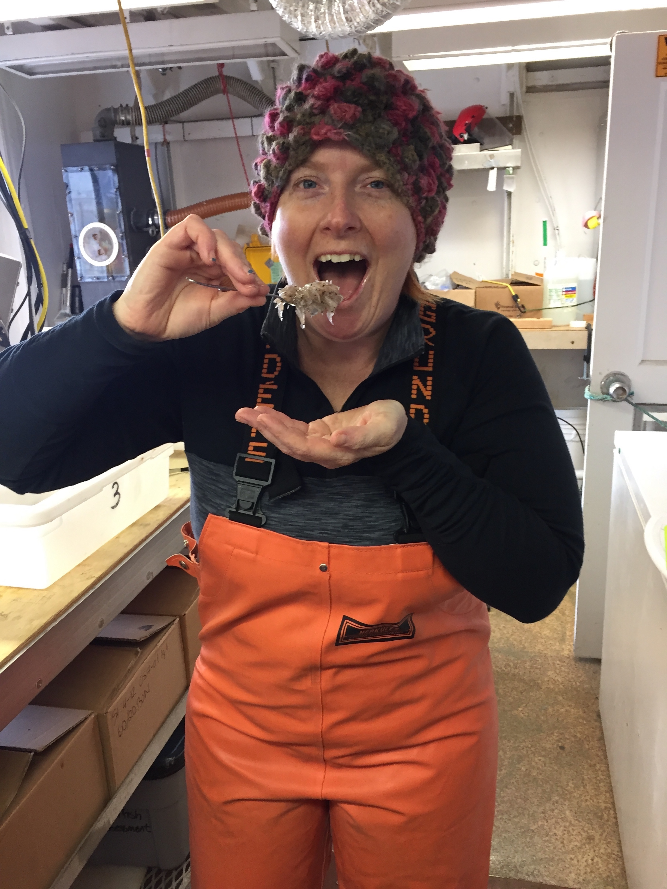
***

- Recent transplant to Stockholm.
- Government fishereies researcher turned data scientist.
- Built R-packages FastrCAT, rrza, and fishgutr.
- Made my first PR during Tidyverse Dev Day on the dplyr package 🎉.
- I also love crafting and sea critters 😍!

R Packages on CRAN
========================================================
incremental: true 
left:60%


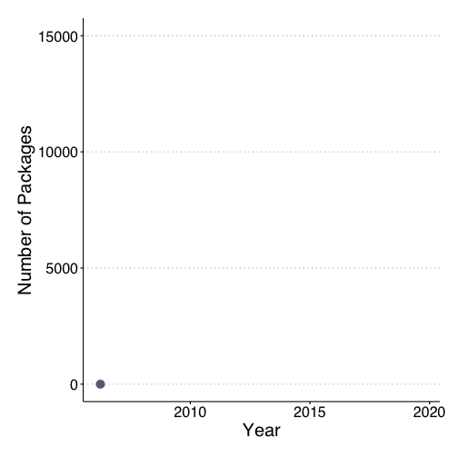
***
As of this year
- 15007 on CRAN
<br>
<br>
- ~ 2116 on GitHub (includes dev versions of CRAN Packages)
<br>
<br>
- 1741 on BioConductor
<br>
<br>
- ~ 18864 + known packages!  🤯


So many packages, why make more?
========================================================
incremental: true 
left:40%


***
- A 📦 can be just for you
<br>
<br>
- A 📦 can be specific to your use case
<br>
<br>
- 📦's are easily sharable
<br>
<br>
- 📦's are great for method development, easy documentation
<br>
<br>
- 📦's encapsulate a project, all files in one place!


Elisabeth: why I built a package
========================================================
incremental: true 
left:50%


***

- We recognized the need to implement (and develop) epidemiological methods in R in order to ease its use.
<br>
<br>
- Made us think about how we could format our package to make it user-friendly. 


Nissa: why I built a package
========================================================
incremental: true 
left:16%

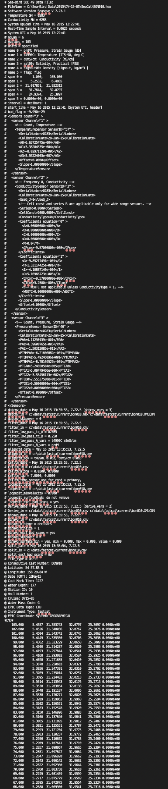

***
- Data was trapped in a particular type of oceanographic file
<br>
<br>
- Thousands of these files were created each field season
<br>
<br>
- Past methods ment data wasn't available for more than a year
<br>
<br>
- I wanted to use the data while still out on the research cruise 🚢 📈!

So, I built FastrCAT
========================================================
incremental: true 
left:50%

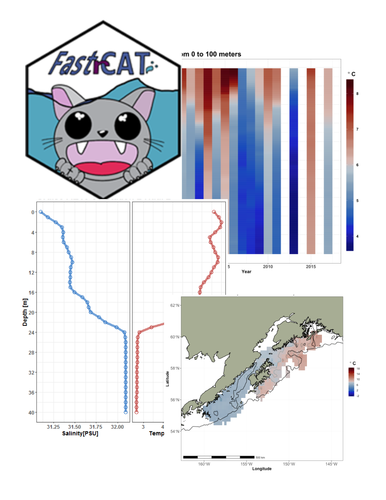

***
FastrCAT...

- streamlined the data aquisition
- did not have to wait a year or more
- has functions to produce maps, plots and reports
- the package was used succesfully this past field season!

Todays Journey
========================================================
left:50%


***

Basics
- style
- readable code

Package design decision examples:
- documentation 
- dependencies
- user interaction

First Steps: Picking a Style
========================================================
incremental: true 
left:40% 


***
- Google Style Guide
https://google.github.io/styleguide/Rguide.html
<br>
<br>
- Tidyverse Style Guide
https://style.tidyverse.org/
<br>
<br>
- Biocondoctor Style Guide
https://bioconductor.org/developers/how-to/coding-style/
<br>
<br>
- Your job might also have its own guide too.

What is human readable code?
========================================================
incremental: true 
left:50% 


***
Wikipedia defines human readable as,  
  
"A human-readable medium or human-readable format is a representation of data or information that can be naturally read by humans."  
<br>
<br>
As humans we are great at telling stories, your code is a narrative


Readable Code Basics
========================================================
incremental: true 

- meaningful file names, w/o spaces

```r
arctic_fish_data_clean.csv
```
- not

```r
finalFINAL_final I really mean it pleaseBE done.csv
```
- objects or variables are nouns

```r
friend_group <- c("Dominique", "Hollis", "Sam", "Robyn", "Ridley") 
```

```r
acorn_count <- c(1, 3, 5, 7, 2, 0)
```

Readable Code Basics
========================================================
incremental: true 

- functions are verbs, actions

```r
who_called <- function(friend_group){"Who called me?"}
```

```r
feed_the_squirrel <- function(acorn_count){"Do I have enough acorns to feed each squirrel?"}
```
- when naming objects or functions use snake_case 🐍_🐍  or CamelCase 🐫🐫  
- do not use dot.case


Documentation
========================================================
incremental: true 
left:50% 

We all love to write documentation 😐

***
- R package development methods force you to document
- You can taylor documentation realtive to your audience
- Documentation comes at many levels
  + variable
  + funtion
  + package
  + vignette / walk through example


Både hängsle och livrem
========================================================
incremental: true 

- *Do not confuse!* To as large extent as possible, use the same argument
names as some package you build your package upon, or are familiar with.  
- Give reproducable examples for different functionalities of your function
and write down definitions.
- Complement with describing your method in a journal article or a vignette.

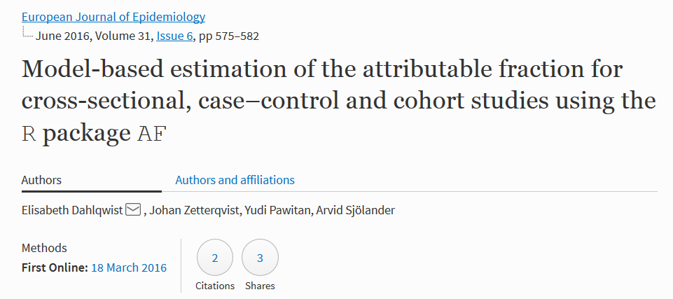


Writing Error Messages
=======================================================
incremental: true 
left:50%  


***
- error writing is a form of documentation
- understand how and why errors occur 
- write clear and unambiguous directions
- use the appropriate level of language
- and be positive! 

How the error occured
======================================================= 
incremental: true 
left:50%  

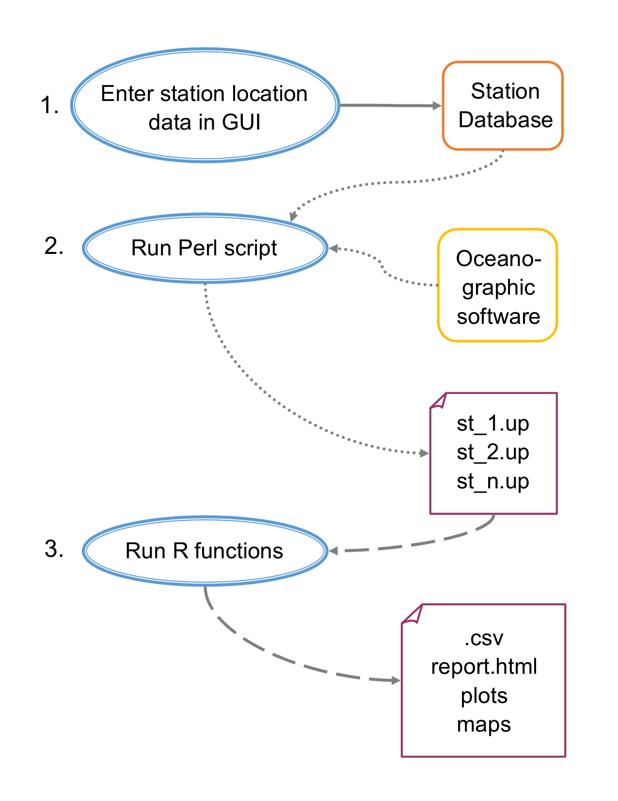

***

- error occured at step one  

- error was common, I did it too!  

- if step one did not occur, .up files would be missing header information  

- before package error might go undedected for a year  

- at this point fixing error became complicated

Handling the error message
=======================================================
incremental: true 
<style>
.reveal code .r{
font-size:18pt
}
.reveal pre{
font-size:8pt
}
</style>

```r
# Determines if file has header information -----------------------------------
    if(length(grep("@ ", full_table,ignore.case = TRUE)) == 0){

      no_head_files[[i]] <- paste("This file", temp[i],
                                 "has no header info needs to be reprocesed.",
                                 sep = " ")

      warning(paste("This file", temp[i],
                    "has no header info, needs to be reprocesed.", sep = " "))

      next()

    }else{
```

- conditional statement checks for header in single file
- if no header info found writes warning to console. 
- makes a table of all files without headers to write in report.


Handling the error message
=======================================================
incremental: true 
<style>
.reveal code .r{
font-size:18pt
}
.reveal pre{
font-size:8pt
}
</style>


```r
  No_head_files <-if(is.null(no_head_files) == TRUE){

    "All header information entered into MasterCOD. High Five!"

  } else {

   data.frame(unlist(no_head_files))
  }
```

- Additional conditional determines if error table has errors
- This will be written to the report
- Add positive reinforcement! 

Careful with your dependencies
=======================================================
incremental: true 
left:40%
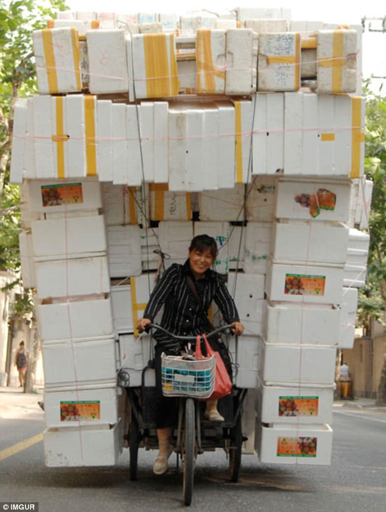

***
Dependencies are the other packages your package needs to run. You
should try and ask yourself these questions
- Does the size of your package matter?
- How much complexity is needed?
- Do my users understand the packages I'm adding as dependencies?
- If the other package function is the best, is there a reason to rewrite it? 


It Depends
=======================================================
incremental: true 
left:45%

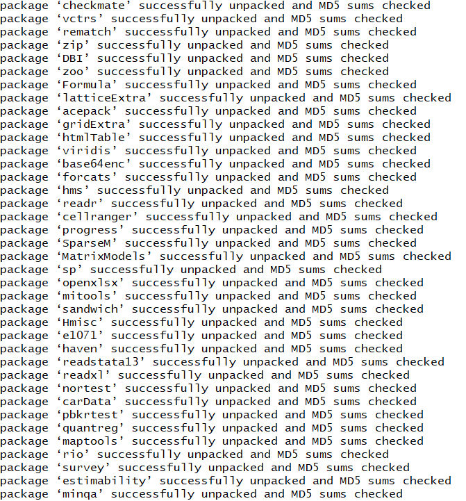

***
- *Be aware* of the difference between types of dependencies vs. depends | import | suggests
- *Do not use depends *

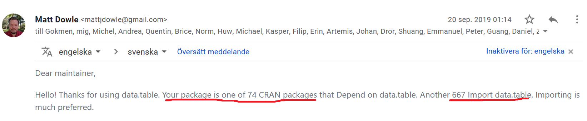


Making maps
=======================================================
left: 40%
incremental: true 
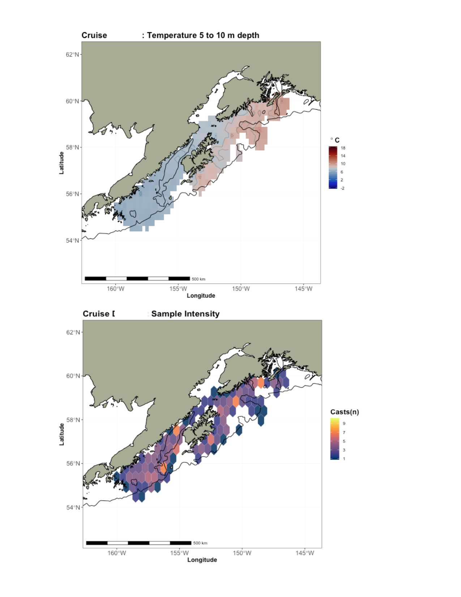

***
- Maps were requested after all the plot functions were added.  

- There were limitations for choosing a mapping package  
  + no to basic internet out at sea  
  + using ggmap was out  

- To move forward, I needed to bundle our map files within the package
  + the package was going to be large
  + and full of dependencies

Making maps
=======================================================
left: 30%
incremental: true


***

Mapping function dependencies
- sf: Simple Features
- sp: Classes and Methods for Spatial Data
- gstat: Spatial and Spatio-Temporal Geostatistical Modelling, Prediction and Simulation
- raster: Geographic Data Analysis and Modeling
- ggplot2: data visualization

Making maps
=======================================================
left: 30%
incremental: true

<style>
.reveal code .r{
font-size:18pt
}
.reveal pre{
font-size:8pt
}
</style>

- How the base map is brought into the function

```r
# bring in the shape files to make the basemap --------------------------------

MAP <- sf::st_read(dsn = system.file("extdata", package = "FastrCAT"),
                   layer = "Alaska_dcw_polygon_Project", quiet = TRUE)
```

- This part tells the function where to find the mapping files in your package library

```r
system.file("extdata", package = "FastrCAT")
```

- When you are writing your package you place the files in the inst/extdata folder
- One caveat is that the files are not hidden.
- For other file types you could convert them to sysdata.rda to hide the original files. 

Human centered interactions
=======================================================
left: 50%


***
“Good design is actually a lot harder to notice than poor design, in part because good designs fit our needs so well that the design is invisible, serving us without drawing attention to itself. Bad design, on the other hand, screams out its inadequacies, making itself very noticeable.”  
  
Donald A. Norman, The Design of Everyday Things

Formatting the output
=======================================================
left: 25%
incremental: true

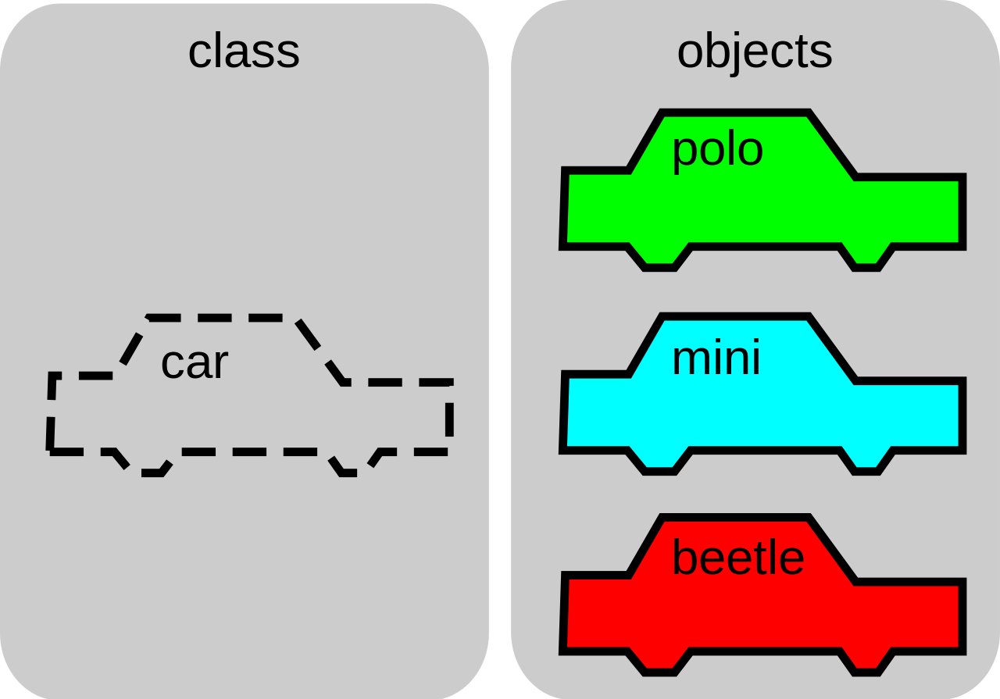

***

- Use S3 or S4 classes in R to format the output so that your users easily understands the output.
- Your user may want loads of information from your package but it is not very usefull to print all at once.
- Example glm. You actually get a lot of output but only selected information is shown when using print(fit) or summary(fit). This is what you use "object oriented" programming with S3 and S4 classes for.

Formatting the output
=======================================================
<style>
.reveal code .r{
font-size:18pt
}
.reveal pre{
font-size:8pt
}
</style>
Summary of glm object

```r
> summary(fit)

Call:
glm(formula = Y ~ X + Z + X * Z, family = binomial, data = data)

Deviance Residuals: 
    Min       1Q   Median       3Q      Max  
-2.4742  -0.8863   0.4277   0.8371   2.3265  

Coefficients:
            Estimate Std. Error z value Pr(>|z|)    
(Intercept)  -0.1806     0.1079  -1.674   0.0941 .  
X             1.0075     0.1544   6.525  6.8e-11 ***
```
Summary of AFglm object

```r
> summary(AFglm_est)
Call:  
AFglm(object = fit, data = data, exposure = "X")

Estimated attributable fraction (AF) and untransformed 95% Wald CI: 

        AF  Std.Error  z value     Pr(>|z|) Lower limit Upper limit
 0.1664325 0.03027685 5.497019 3.862643e-08   0.1070909    0.225774
```


User Workflow
=======================================================
left: 25%
incremental: true


***
- Two Users, those who knew R and those who did not
- I built workflow around non-R users needs which required:
  + determine barriers and follow a path of least resistance
  + matching workflow to running Perl script in terminal
  + secretly having them open an R session in terminal
  + explicit instructions/examples to run functions in session


Package it all up🎉
========================================================
left:40%


***
Today we learned  

- We can have different experiences/reasons to build packages

- Meet your users where they are at and support them
 
- You should Document, Document, Document...nDocument  

- When you are ready to build a package there is a whole community to support you. 


Package building resources
========================================================
Writing an R package from scratch, Hilary Parker of Not So Standard Deviations  
https://hilaryparker.com/2014/04/29/writing-an-r-package-from-scratch/

R Packages by Hadley Wickam  
http://r-pkgs.had.co.nz/

R Packages: The Whole Game by Jenny Bryan   
https://r-pkgs.org/whole-game.html
also see https://stat545.com/

R package primer by Karl Broman  
https://kbroman.org/pkg_primer/


Thank you!🎉
========================================================
left:40%


***
Find all the slides and code here
https://github.com/R-Ladies-Stockholm/Package-Basics-Presentation

Follow us on Twitter @RLadiesSthlm
or Facebook @RLadiesStockholm 

In the near future 5 minute favorite package talks and Package building workshop!


And now for a quick package building demo. 


