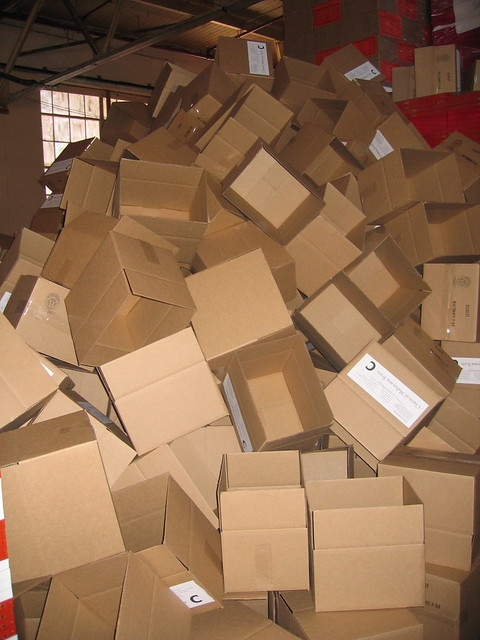
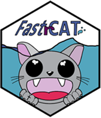

Basics in R package Building: user centered problems and solutions
========================================
author: Elisabeth Dahlqwist & Nissa Ferm
date: R-Ladies Stockholm on October 23, 2019
font-import: http://fonts.googleapis.com/css?family=Mansalva
font-family: 'Mansalva'

Elisabeth Dahlqwist
========================================================
Cool things about me...

- Biostatistician
- neato thing two

Nissa Ferm 
========================================================
incremental: true

***
- Recent transplant to Stockholm.
- Government fishereies researcher turned data scientist .
- Built R-packages FastrCAT, rrza, and fishgutr.
- Made my first PR during Tidyverse Dev Day on the dplyr package 🎉.
- I also love crafting and sea critters 😍!

R Packages on CRAN
========================================================
incremental: true 
left:60%

***
As of this year
- 15007 on CRAN 
- ~ 2116 on GitHub (includes dev versions of CRAN Packages)
- 1741 on BioConductor
- ~ 18864 + known packages!  🤯

So many packages, why make more?
========================================================
incremental: true 
left:40%

***
- A 📦 can be just for you  

- A 📦 can be specific to your use case  

- 📦's are easily sharable 

- 📦's are great for method development, easy documentation  

- 📦's encapsulate a project, all files in one place!

Elisabeth why I built a package
========================================================

- share new stats methods

Why I built a package
========================================================
incremental: true 
left:16%

***
- Data was trapped in a particular type of oceanographic file

- Thousands of these files were created each field season 

- Past methods ment data wasn't available for more than a year  

- I wanted to use the data while still out on the research cruise 🚢 📈!

So I built FastrCAT
========================================================
incremental: true 
left:50%

***
- Streamlines data aquisition
- Don't have to wait a year or more!
- Has functions to produce maps, plots and reports
- Was used succesfully this past field season 

First Steps: Picking a Style -E
========================================================

***
- human readable code , pretty
- Google Style Guide, functional thinking
- Tidyverse Style Guide

What is human readable code? -N
========================================================
- nouns
- verbs
- snake_case, CamelCase, dot.case (dot has meaning)

Documentation
========================================================

- how creating a package forces you to document everything
- documentation is realtive to your audience
- unhelpful documentation
- helpful documentation

Documentation - E
========================================================
- function documentation example
- why is this helpful
- give a reproducable example
- who are your users and how you write the documentation
- example glm object

Documentation
========================================================
- package level example
- why is this helpful
- should you add a data set

Documentation
========================================================
- vingette example
- you want your users to understand, give examples

Elisabeth Example One
=======================================================

- targeting your users
- Journal Article about package and examples with theory
- what to do, documentation in line level you expect from users

Nissa Example One
=======================================================
- how error writing is documentation too
- writting errors to help your users

Careful with your dependencies
=======================================================

***
- some overview of dependencies

Elisabeth Example Two
=======================================================

- import vs depends
- which r version with uploading to CRAN r devel

Nissa Example Two
=======================================================
- maps without the internet
- why I didn't use ggmap
- how did I realize this was an issue
- how did I solve this issue
- where it went in the package folder hierarchy
- what were all the packages I used
- show how it was written in the package/ folders

How your users interct with your package
=======================================================

***
- transition slide
- interacting

Elisabeth Example Three
=======================================================

- what is the output of your package
- in r oop, classes
- print glm and formats example, plot function
- model object look similar across packages

Nissa Example Three
=======================================================

- from the console
- why I did it this way for my users
- how you share

Last Slide 
========================================================
- live package build in Rstudio

